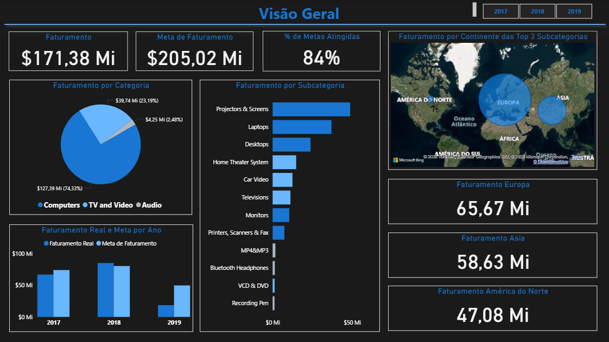

# Projeto – Análise de Vendas x Metas

Dashboard desenvolvido em Power BI para análise do faturamento, acompanhamento de metas e identificação de oportunidades de negócio, utilizando ETL, modelagem dimensional e DAX para apoiar a tomada de decisão baseada em dados.

## Dashboard

## Tecnologias utilizadas

- Power BI Desktop
- Power Query
- DAX
- Modelagem Dimensional (Star Schema)
- Excel
- CSV
- JSON

  
## Objetivos do projeto

- Realizar o processo de ETL (Extração, Transformação e Carga);
- Construir um modelo dimensional em esquema estrela;
- Desenvolver medidas utilizando DAX;
- Criar dashboards interativos para análise de vendas e metas;
- Identificar oportunidades de negócio por meio da análise dos indicadores.

## Principais indicadores

- Faturamento
- Meta de faturamento
- % da meta atingida
- Comparativo anual

## Arquivos do projeto

| Arquivo                    | Descrição             |
| -------------------------- | --------------------- |
| VENDAS X METAS.pbix        | Projeto Power BI      |
| RELATÓRIO TÉCNICO.pdf      | Documentação completa |
| Desafio Vendas x Metas.pdf | Requisitos do desafio |

